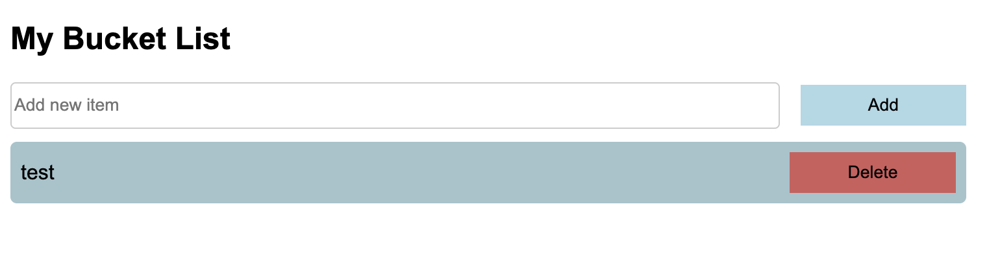

# WITI-Cohort-4-JS-Exams
Answers to Intermediate Web Design and Development JS exams and quizzes

## Section A: MCQs(8 mks)
1. B) [1, 2, 3, 4]
(Arrays are reference types; y refers to the same array as x.)

2. C) Character
(JavaScript doesn't have a specific "Character" type — characters are just strings of length 1.)

3. B) "object"
(Quirk in JavaScript: typeof null returns "object".)

4. B) To modify each element and return a new array
(That’s what .map() is for.)

5. B) 10
(var is function-scoped, so a inside the if re-declares the same variable.)

6. D) All of the above
(Each can convert a string to an integer, though results can differ slightly.)

7. A) pop()
(Removes the last element from an array.)

8. C) const
(Used for variables that cannot be reassigned.)


## Section B: Essay Questions(10 mks)

1. let, const, var differences:

    ```
    - var is function-scoped, can be re-declared and updated/re-assigned.

    - let is block-scoped, can be updated/re-assigned but not re-declared.

    - const is block-scoped and cannot be updated/re-assigned or re-declared.
    ```

2. Objects vs Arrays:

    ```
    - Objects store key-value pairs.

    - Arrays are ordered lists with numeric indices.

    - Use objects for structured data; use arrays for ordered collections.
    ```

3. == vs ===:

    ```
    - == checks for value with type coercion.

    - === checks for strict equality (value and type must match).
    ```

4. Events and Example:
    - An event is an action (e.g., click) that can be handled in JS.
    ```js
    Example:

    document.getElementById("myBtn").addEventListener("click", () => {
        alert("Button clicked!");
    });
    ```

5. forEach vs map:

    ```
    - Both iterate over arrays.

    - forEach executes a function but returns undefined.

    - map creates a new array from the return values.
    ```

## Section C: Coding Questions (12 Marks)
1. Reverse a string:
    ```js
    function reverseString(str) {
        return str.split('').reverse().join('');
    }
    ```
2. Sum of even numbers:
    ```js
    function sumEvenNumbers(arr) {
        return arr.filter(n => n % 2 === 0).reduce((a, b) => a + b, 0);
    }
    ```
3. Sum or product function:
    ```js
    function compute(a, b) {
        return a === b ? a * b : a + b;
    }
    ```
4. Palindrome checker:
    ```js
    function isPalindrome(word) {
        const reversed = word.split('').reverse().join('');
        return word === reversed;
    }
    ```

## Section D (Project) 10mks
```
- Project should be able to add items to the bucket list
- Should be able to view all the added items
- Should be able to delete an item and it should disappear from the list and screen
```
